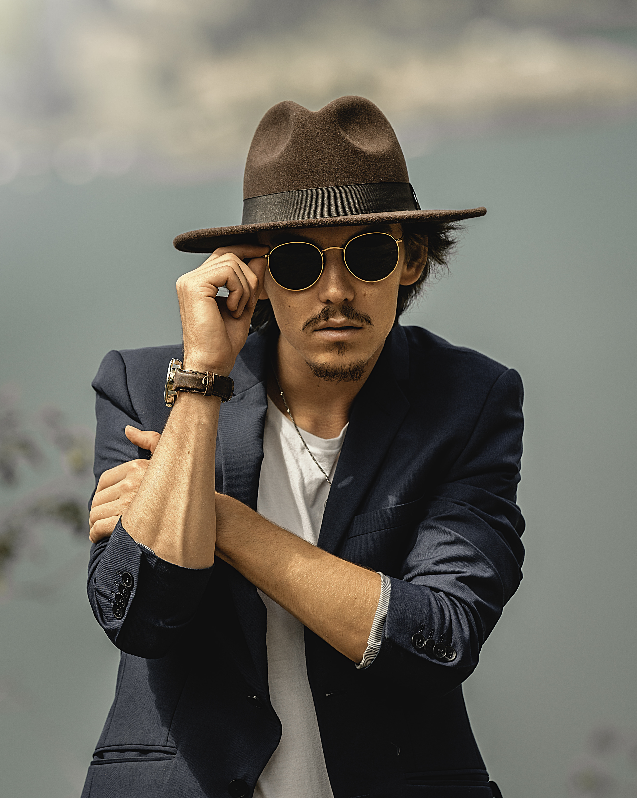

## Current Members

### María Alejandra Luna

<u>Biography</u>

I was born in Ecuador, a small country in South America. I moved to Canada in 2014 where I completed my high school in Prince Rupert, BC. Coming from a country that includes the Galápagos Islands and having the opportunity to visit the Charles Darwin Scientific Research Station has been a motivation in my life to be passionate about Earth and Life Sciences. For this reason, in September 2016, I started my Science degree at Brandon University, choosing geography as my major and mathematics as my minor. During my undergrad studies, I had the opportunity to meet magnificent professors who became my mentors and great support. In May 2020, I accomplished one of my main goals which was to graduate with a B.Sc. at BU.

I joined Dr. Alex Koiter’s lab in 2019 where I gained academically relevant work experience as a student research assistant for a project implemented by Manitoba Association of Watersheds in partnership with Brandon University and Manitoba Beef and Forage Initiatives (MBFI). I am fortunate and excited to be a member of an incredible team of researchers in this lab.  

<u>Research Interests</u>

Pursuing my interests in Earth sciences, primarily in soil, agricultural, and watershed sciences, my M.Sc. research will focus on sediment fingerprinting (i.e., tracing) as a tool to address soil erosion and water quality issues. In particular, my proposed topic deals with understanding and quantifying field-scale variability in fingerprint properties and the implication this has for modelling sediment dynamics within the Wilson Creek Experimental watershed.

### Colby Sobchuk

<u>Biography</u>

I was born and raised in Brandon,MB. I graduated from Vincent Massey High school, focusing on sciences while playing varsity volleyball. I was motivated to enroll in Brandon University’s Bsc. in Environmental Science, having grown up loving to do outdoor activities and hearing about environmental issues society is faced with. 

I am fortunate and excited to help out Dr. Koiter’s team and gaining relevant work experience. I am mostly working with the phosphorus analysis portion of the project, which, includes creating the composite reagent to react with phosphorus and running the samples through the UV spectrometer. 

While I haven’t found my particular niche yet, I love the general process of learning and understanding a wide array of problems and potential solutions.

### Adriana Avila

### Autumn Wiebe
<u>Biography</u>

I am a Masters student with Dr. Koiter and Dr. Glenn from the Brandon Research and Development Centre. My research is focused on measuring greenhouse gas emissions from agricultural soil using the static chamber method. With this method, I am testing a reduced timestamp method which takes two timestamps from each chamber, and comparing it to a four timestamp method. I am also analyzing the greenhouse gases released from soils taken from three different landscape positions (upland, transition and wetland edge) with different moisture contents. 
Before beginning my Masters degree, I completed my a Diploma of Land and Water Management from Assiniboine Community College (2016), then completed a joint program with Brandon University to earn my Undergraduate degree in Environmental Sciences (2019). Throughout my studies, I have always had a love for the environment and knew I wanted to pursue a career in this field, but it wasn’t until after working part time at the Brandon Research and Development Centre that I found my true passion for agricultural research with both soils and greenhouse gases.

### Jonathon May
