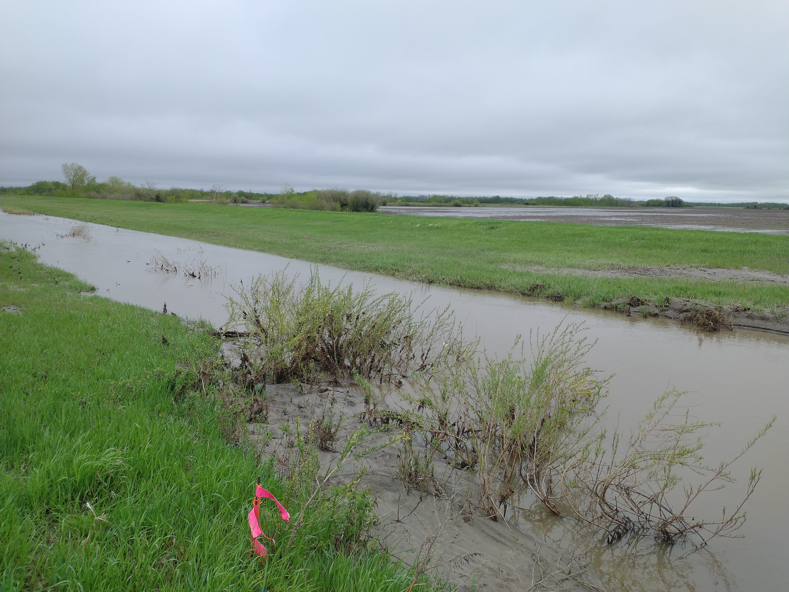

I am currently recruiting a summer research assistant. This is an excellent opportunity for an undergraduate student to gain research experience. This position involves both field and lab work as well as data entry, summarizing, and reporting. My research group investigates a wide range of agricultural issues including soil erosion, downstream sedimentation, nutrient dynamics, greenhouse gas fluxes, and extremes of moisture. For a complete description of qualifications, experience, and eligibility please see the job posting [here](https://www.brandonu.ca/jobs/job/research-assistant-i-department-of-geography-environment-2/).

To apply: Please send your cover letter and resume clearly outlining how you meet the qualifications, experience, and eligibility to
Dr. Alex Koiter, Department of Geography and Environment, Brandon University at koitera@brandonu.ca

Deadline to apply: **4:30 p.m. on April 13, 2023**

If you would like more information on the position please don't hesitate to reach out to me.

