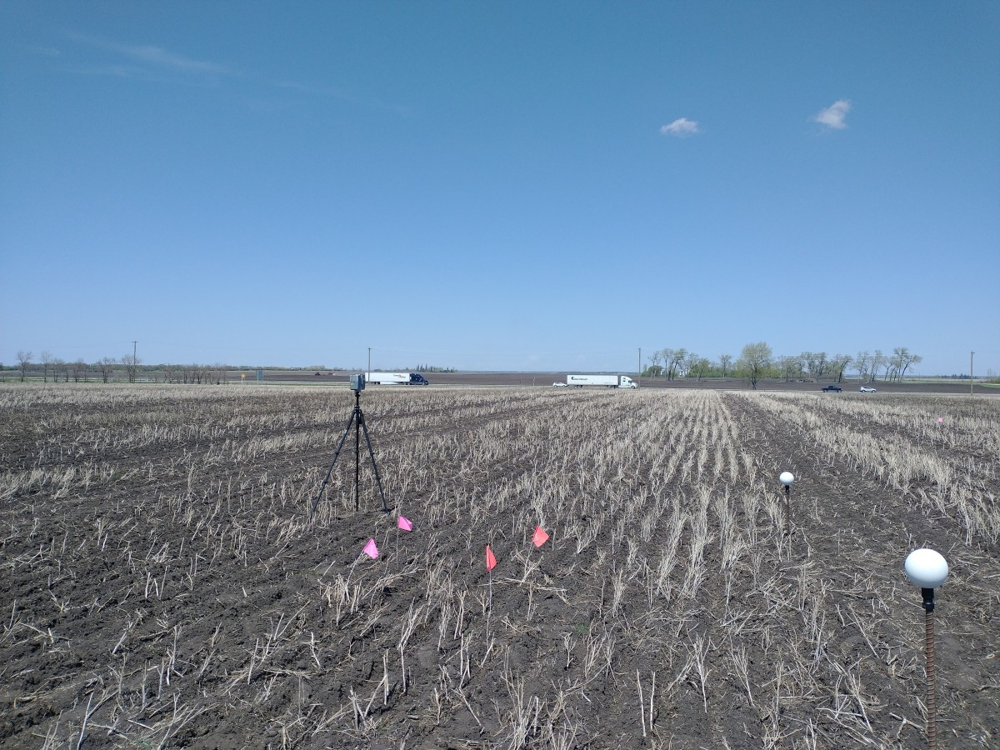
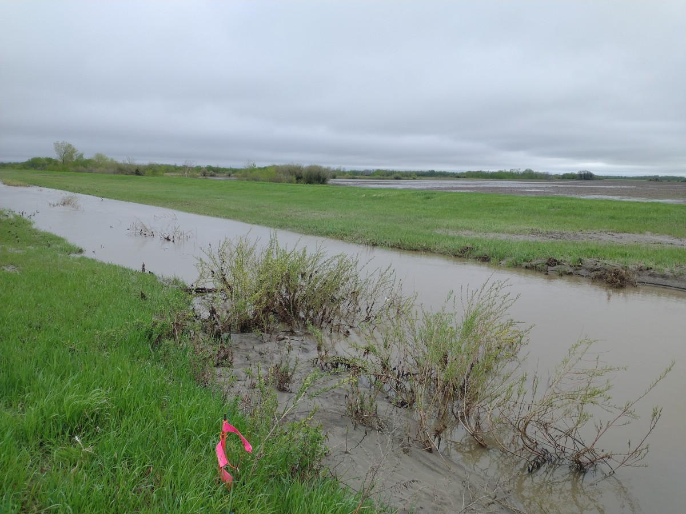
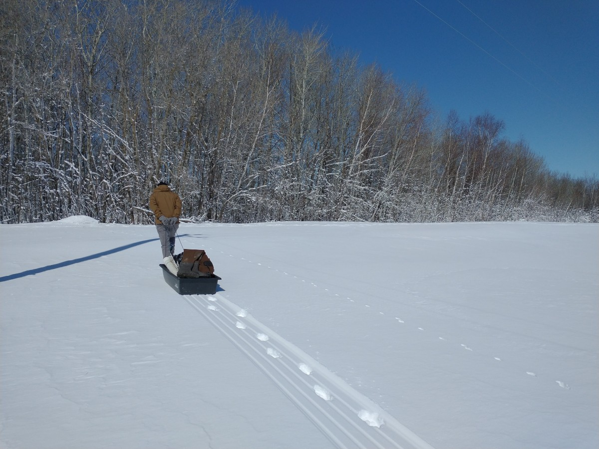
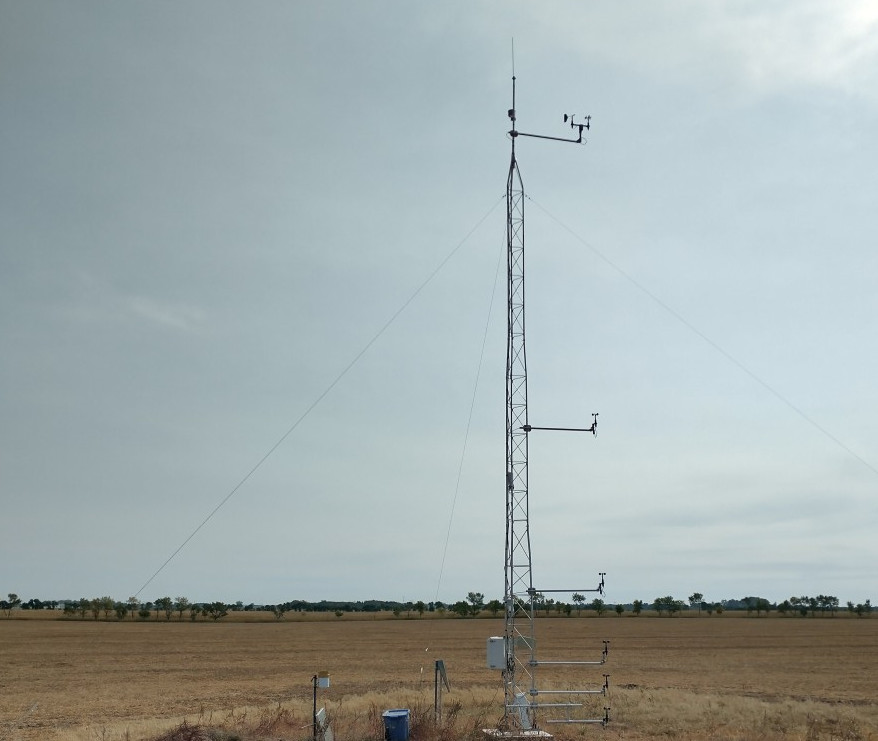

### MSc Position in Real-Time In-Situ Soil Monitoring for Agriculture

We are seeking a highly motivated Master of Science candidate to join a collaborative research project between Brandon University (BU) and Agriculture and Agri-Food Canada (AAFC), starting in September 2026. The successful applicant will enroll in the [Master of Science (Environmental and Life Sciences)](https://www.brandonu.ca/mels/) (MELS) program at BU in full time studies by September 1, 2026. The student will work on a project focused on using the [Real-Time In-Situ Soil Monitoring for Agriculture (RISMA)](https://agriculture.canada.ca/en/agricultural-production/soil-and-land/real-time-situ-soil-monitoring-agriculture) network data. The successful candidate will help develop a research project that links the soil moisture network data to crop yield, agronomy, soil erosion, and/or other agri-environmental processes. Fieldwork will be conducted in Manitoba, with additional laboratory work required. This opportunity is ideal for candidates interested in agriculture, environmental monitoring, and data-driven approaches to agriculture. 

[Learn more about this opportunity](images/MS_RISMAS_poster_2026.pdf)

