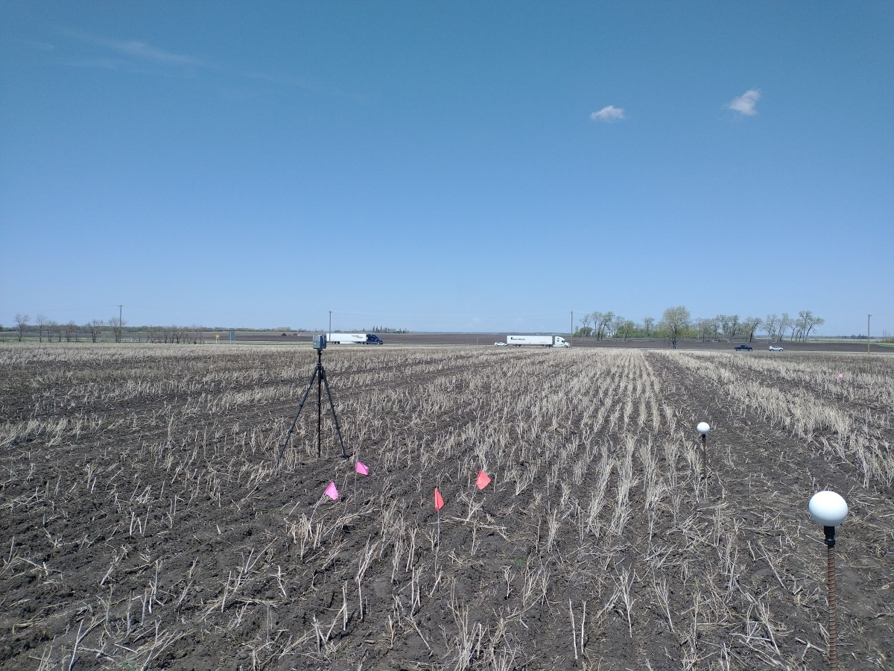
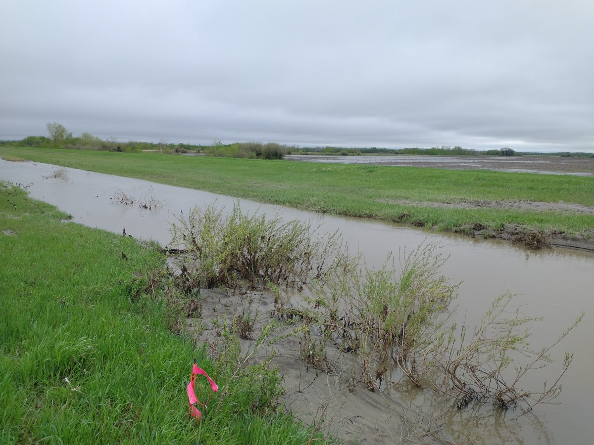
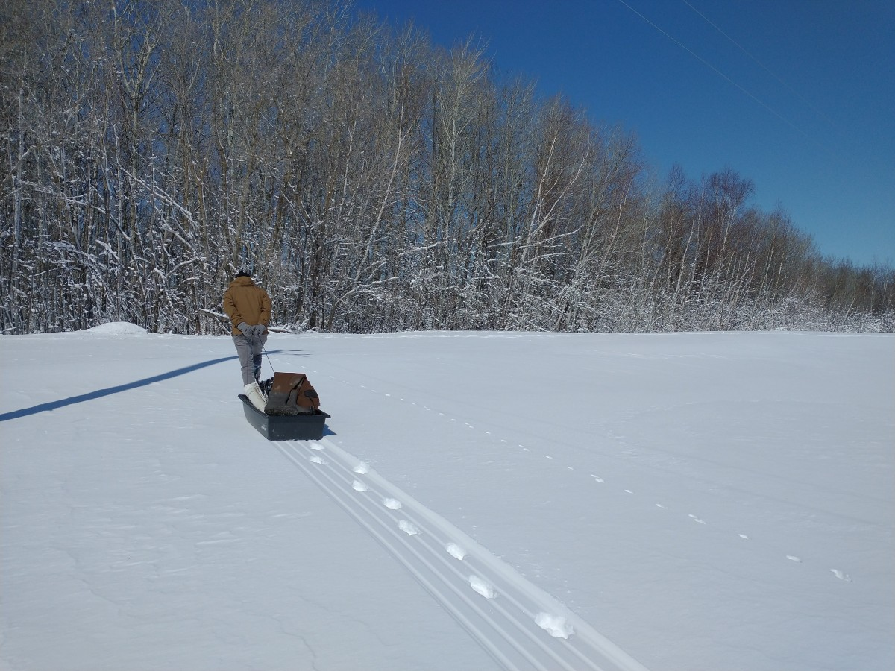
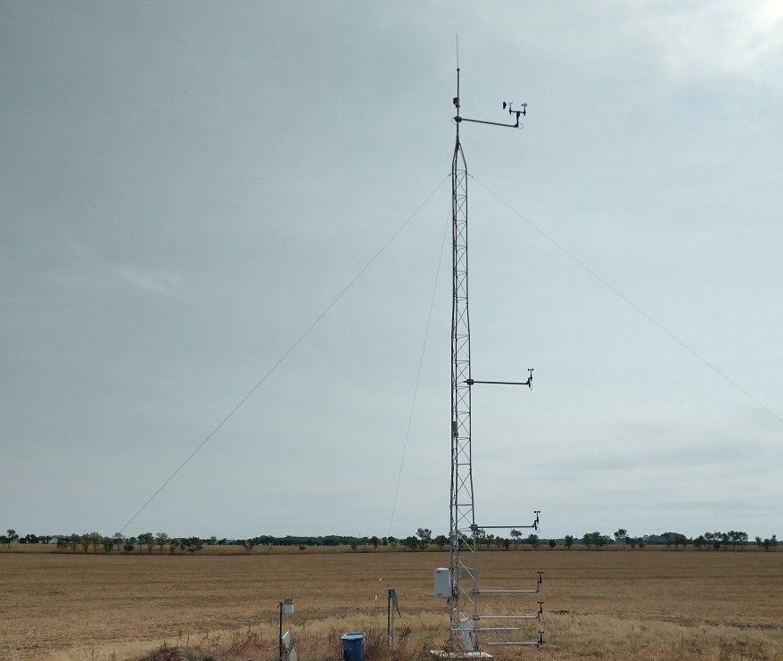

<!-- ### MSc Position in Real-Time In-Situ Soil Monitoring for Agriculture -->

<!-- We are seeking a highly motivated Master of Science candidate to join a collaborative research project between Brandon University (BU) and Agriculture and Agri-Food Canada (AAFC), starting in September 2026. The successful applicant will enroll in the [Master of Science (Environmental and Life Sciences)](https://www.brandonu.ca/mels/) (MELS) program at BU in full time studies by September 1, 2026. The student will work on a project focused on using the [Real-Time In-Situ Soil Monitoring for Agriculture (RISMA)](https://agriculture.canada.ca/en/agricultural-production/soil-and-land/real-time-situ-soil-monitoring-agriculture) network data. The successful candidate will help develop a research project that links the soil moisture network data to crop yield, agronomy, soil erosion, and/or other agri-environmental processes. Fieldwork will be conducted in Manitoba, with additional laboratory work required. This opportunity is ideal for candidates interested in agriculture, environmental monitoring, and data-driven approaches to agriculture.  -->

<!-- [Learn more about this opportunity](images/MS_RISMAS_poster_2026.pdf) -->

<!-- ### I am not currently seeking new members for my research group. This includes all staff positions and graduate student opportunities. -->

### Research Assistant Position

I am currently recruiting research assistants to join my research team from mid-July to the end of August. The project is part of Living Lab Manitoba and aims to quantify the above- and below-ground carbon inventory of treed areas in agro-ecosystems, including shelterbelts, wooded pastures, and natural forest areas, and to assess how carbon storage relates to ecosystem attributes and management practices. Field and laboratory experience with soils and vegetation would be considered an asset but is not required. For details and to apply, see the [Research Assistant I](https://www.brandonu.ca/jobs/job/research-assistant-i-department-of-geography-environment/) and [Research Assistant II](https://www.brandonu.ca/jobs/job/research-assistant-ii-department-of-geography-environment-2/) postings.

