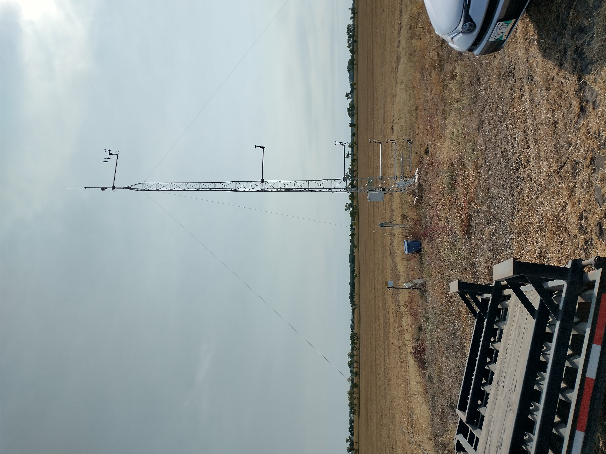

I am currently recruiting one summer research assistant, level I or III, depending on experience! 35hrs/week, ~ May 14 - August 31, 2025

This is a great opportunity for a student enrolled in an Earth Science related program to get some hands-on research experience.

Please visit the job posting for a full description of the position and details on how to apply. 

[Level I](https://www.brandonu.ca/jobs/job/research-assistant-i-department-of-geography-environment/)

or 

[Level III](https://www.brandonu.ca/jobs/job/research-assistant-department-of-geography-and-environment/)

Applications are to be received by: 4:30 p.m. on May 14, 2025

