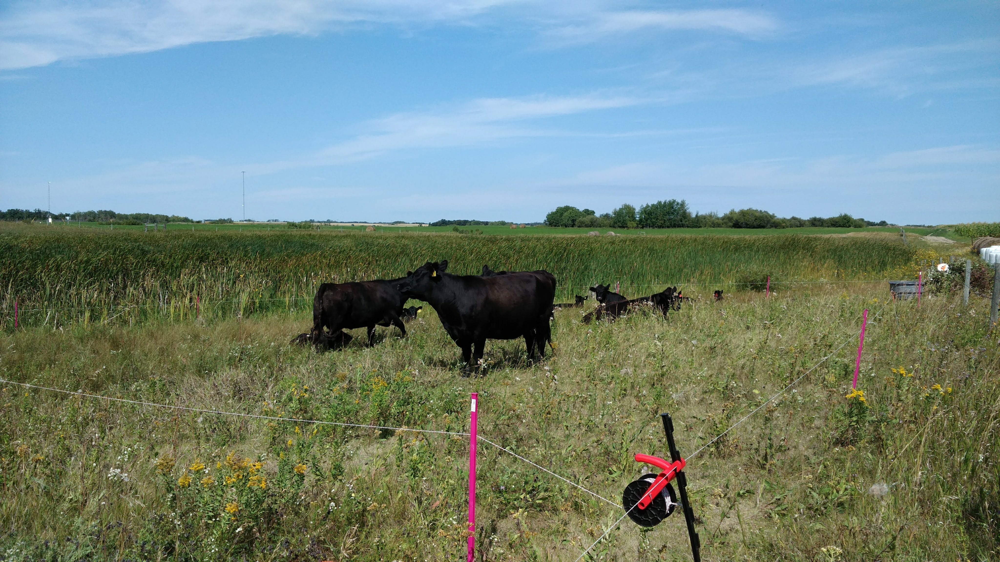

## Current Projects
My research, broadly speaking, focuses on the interaction between watershed management and geomorphology and how this affects both soil erosion, sediment delivery, and downstream sediment transport.

### Sediment Fingerprinting
Sediment fingerprinting refers to working in an upstream direction in an inferential manner to determine the source(s) of sediment. The approach is based on the idea that one or more of the natural physical or biogeochemical properties of the sediment will reflect its source, and therefore can be used diagnostically to identify the origin(s) of the sediment. My work has focused on using geochemical, radionuclide and colour fingerprints to assess the sources of sediment within a watershed and link it to land use/management and geomorphology. 

In these projects I both assess sources of sediment and refine the sediment fingerprinting approach. In particular, I am evaluating different types of tracers, refining sampling and modelling techniques, and assessing the benefit of including multiple lines of evidence. I currently have projects in the Tobacco Creek, La Salle River, South Tobacco Creek, and Wilson Creek watersheds.

### Riparian Management
The riparian zone is the linkage between the terrestrial and aquatic environments and as a result is characterized by very distinct gradients in environmental conditions and processes. The riparian zone has a number of processes, including infiltration, immobilization, sedimentation and dilution, that act to buffer and intercept the flow of both dissolved and particulate material to the aquatic environment. Because of these properties, the retention or installation of riparian zones along streams is a common best management practice used in agricultural regions to moderate stream temperatures, stabilize stream banks and reduce the amount of sediment- and nutrient-rich agricultural runoff entering surface waterways

In these project I am investigating if cattle grazing can be used as a management tool to reduce the potential phosphorus loss from agricultural land. The loss of phosphorus is typically high during the spring snowmelt, as the vegetation from previous years acts as a source of phosphorus and the infiltration of runoff into the frozen soil is limited. While little can be done to promote infiltration of phosphorus during this period, the amount of vegetation remaining on the soil surface can be controlled through removal during the previous autumn. Cattle grazing in the riparian area is a potential management tool that can be used to accomplish this.

[Click here to see an article in the MBFI Newsletter](https://static1.squarespace.com/static/59431152f7e0ab3f0144bfe9/t/5e1e3dee2ee5903aac1eb4ea/1579040241754/2020-01-14+-+MBFI+eNewsletter+Jan+2020.pdf)

### Excess Moisture

Natural risks especially natural drought and flood occurrences caused by weather extremes constantly threaten the agriculture economy. Manitoba’s rapidly changing climate conditions are characterized by increased frequency and intensity of excess moisture events. Prolonged excess moisture conditions cause negative effects on agricultural operations that result in loss of crop yield, quality, and farm income. It is necessary for Manitoba producers to use yield forecast tools in order to understand the scope of excess moisture events influencing crop yield, and quality. This information would allow producers to respond appropriately in order to overcome the disaster. 

In these project I am assessing the impacts of excess moisture on crop yield, farm income, and identifying downstream costs and benefits of excess moisture events. This is being achieved through two main mechanisms: 1) interviewing farmers, agricultural/commodity organizations, and other stakeholders; and 2) validation of AquaCrop yield forecasting model for southern Manitoba. 

[Click here to visit the RDI website for more information](https://www.brandonu.ca/rdi/projects/excess-moisture-management/)
